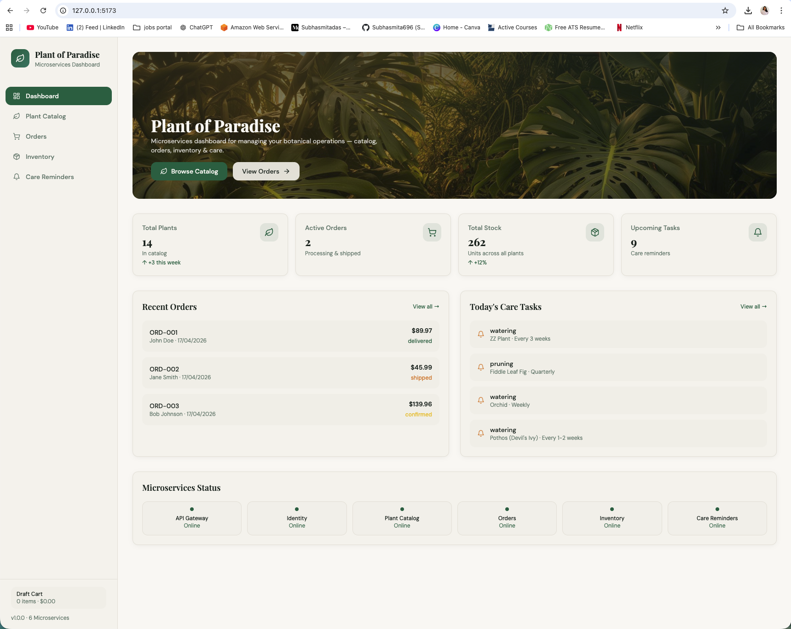
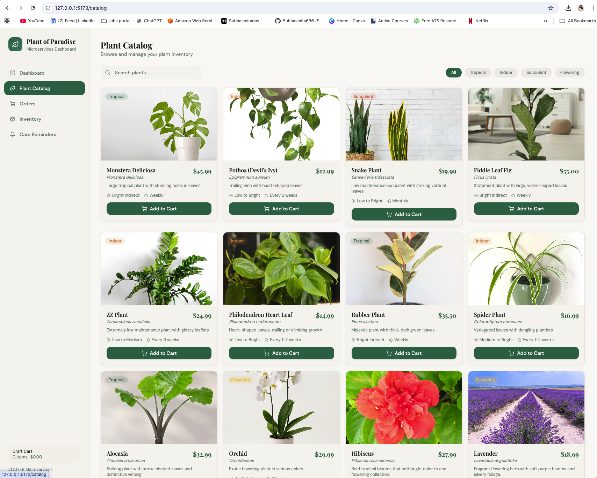
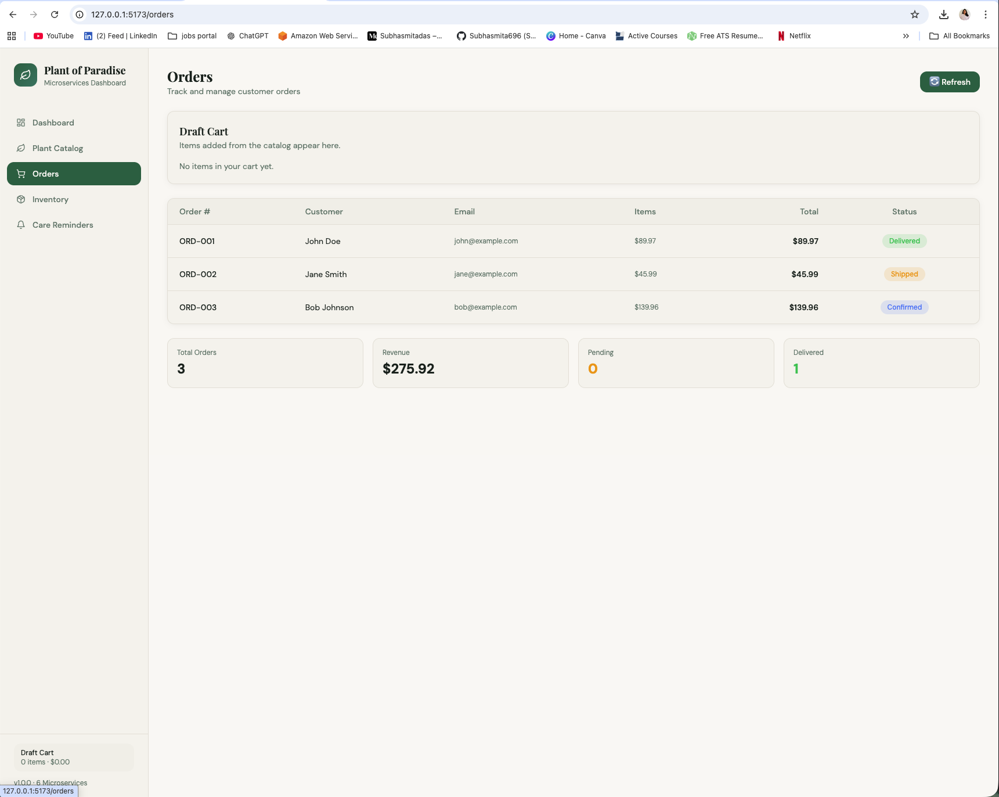
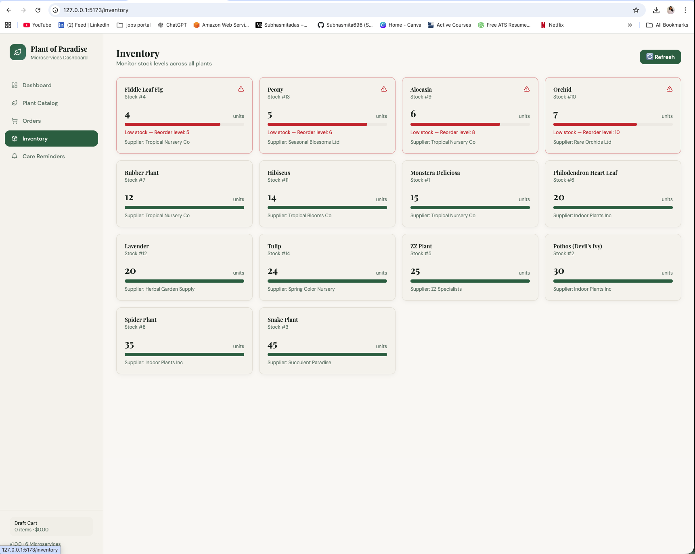
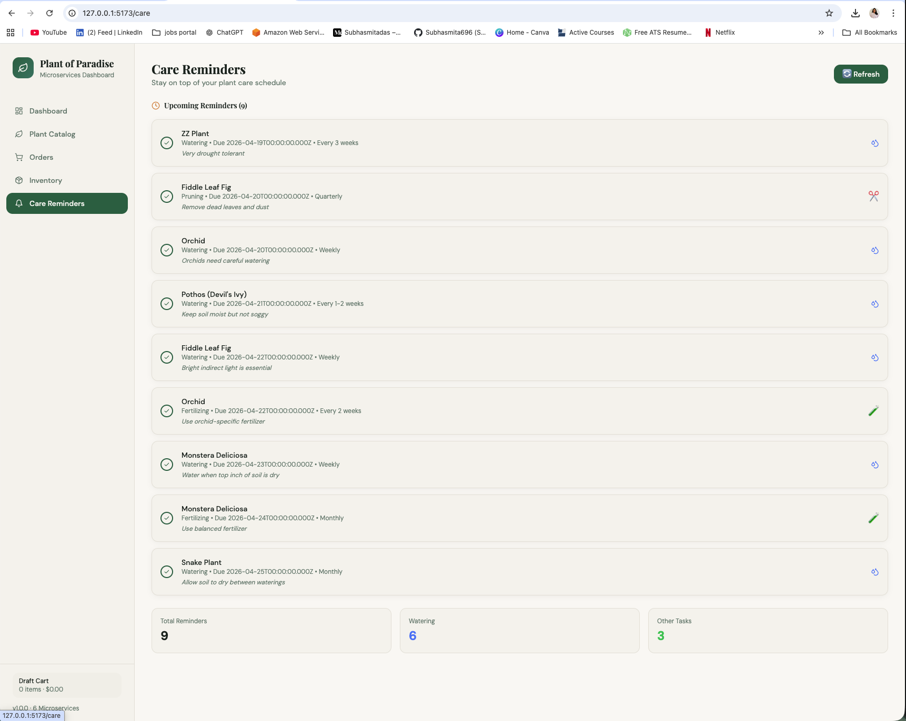

# 🌿 🚀 Cloud-native microservices platform deployed on Azure Kubernetes Service (AKS) using Terraform, GitOps (ArgoCD), and CI/CD pipelines.

This project demonstrates end-to-end DevOps architecture including infrastructure provisioning, containerization, automated deployment, and observability.

> 💡 This project was designed and implemented end-to-end by me, covering infrastructure, CI/CD, deployment, and monitoring.

A modern, full-stack microservices-based e-commerce platform for managing and selling plants. Built with React, Node.js, MySQL, and Docker.

## 👨‍💻 My Contributions

- Designed and implemented end-to-end DevOps architecture
- Built CI/CD pipelines using GitHub Actions / Azure DevOps
- Provisioned cloud infrastructure using Terraform (AWS & Azure)
- Containerized applications using Docker
- Deployed microservices on Kubernetes (EKS/AKS) using Helm
- Implemented GitOps workflow using ArgoCD
- Integrated monitoring with Prometheus and Grafana
- Applied security scanning using Trivy

## 📸 Application Preview

### 🏠 Dashboard


### 🌿 Plant Catalog


### 📦 Orders Management


### 📊 Inventory Monitoring


### ⏰ Care Reminders


**📚 [READ THE COMPLETE GUIDE →](COMPLETE_GUIDE.md)**

---

## 📁 Project Structure

```
Plants_of_paradise/
├── backend/                 # Node.js microservices
│   ├── services/            # 4 microservices (catalog, inventory, orders, care-reminders)
│   ├── shared/              # Shared database and validation
│   ├── docs/                # API documentation
│   ├── Dockerfile           # Backend container
│   └── package.json         # Backend dependencies
│
├── frontend/                # React application
│   ├── src/
│   │   ├── api/             # API client & hooks
│   │   ├── pages/           # Page components
│   │   ├── components/      # UI components
│   │   └── lib/             # Utilities
│   ├── public/              # Static assets
│   ├── Dockerfile           # Frontend container
│   └── package.json         # Frontend dependencies
│
├── infra/azure/             # Terraform for AKS & ACR
│   ├── main.tf              # Infrastructure config
│   ├── variables.tf         # Input variables
│   ├── outputs.tf           # Output values
│   └── terraform.tfvars.example
│
├── helm/paradise-plants/    # Helm chart for deployment
│   ├── Chart.yaml           # Chart metadata
│   ├── values.yaml          # Default values
│   └── templates/           # Kubernetes manifests
│
├── argocd/                  # ArgoCD application manifest
│   └── argocd-application.yaml
│
├── docs/                    # Documentation
│   ├── 1-ARCHITECTURE.md    # Architecture overview
│   ├── 2-DEVOPS_WORKFLOW.md # DevOps workflow
│   ├── 3-INSTALLATION_GUIDE.md # Installation guide
│   └── DOCKER_GUIDE.md      # Docker guide
│
├── config/                  # Configuration files
├── dependencies/            # Lock files
├── azure-pipelines.yml      # Azure DevOps CI/CD pipeline
├── docker-compose.yml       # Local Docker setup
├── COMPLETE_GUIDE.md        # Full documentation
├── README.md                # This file
└── README_TOOLS.md          # Tools installation guide
```

## ⚡ Quick Start

### 🐳 Fastest Way (Docker)

```bash
# Start all services
docker-compose up -d

# Wait 30 seconds for services to health-check
docker-compose ps

# Access the app
echo "Frontend:  http://localhost:5173"
echo "API Docs:  http://localhost:3001/health"
```

### 💻 Local Development

```bash
# Backend
cd backend && npm install && npm run dev

# Frontend (new terminal)
npm install && npm run dev
```

---

## 🎯 What's Included

| Feature | Status |
|---------|--------|
| 🌿 Plant Catalog | ✅ Complete |
| 📦 Inventory Management | ✅ Complete |
| 📋 Order Management | ✅ Complete |
| 🌱 Care Reminders | ✅ Complete |
| 🎨 Responsive UI | ✅ Complete |
| 📡 REST API | ✅ Complete |
| 🔄 Microservices | ✅ Complete |
| 🐳 Docker Setup | ✅ Complete |
| 📊 Sample Data | ✅ Complete |

---

## 🏗️ Architecture

```
Frontend (React)
    ↓ HTTP/REST
├─ Catalog Service (Node.js)    [Port 3001]
├─ Inventory Service (Node.js)  [Port 3002]
├─ Orders Service (Node.js)     [Port 3003]
└─ Care Reminders (Node.js)     [Port 3004]
    ↓ SQL
MySQL Database [Port 3306]
```

---

## 🚀 Services

| Service | URL | Purpose |
|---------|-----|---------|
| Frontend | http://localhost:5173 | User Interface |
| Catalog | http://localhost:3001 | Plant Products |
| Inventory | http://localhost:3002 | Stock Management |
| Orders | http://localhost:3003 | Order Processing |
| Care | http://localhost:3004 | Care Scheduling |

---

## 🚀 DevOps & Deployment

This project includes a full cloud-native deployment workflow:
- Azure DevOps pipeline for build, scan, and deploy
- Terraform for Azure infrastructure (AKS, ACR, networking)
- Docker container images built for frontend and backend
- ArgoCD + Helm for GitOps deployment to AKS
- Prometheus and Grafana for runtime monitoring
- Trivy for source and image security scanning

### Required infrastructure

#### Production-like deployment resources
- **1 Azure Resource Group**
- **1 Azure Kubernetes Service (AKS) cluster**
  - Recommended node count: 3
  - Recommended VM size: `Standard_D4s_v3`
- **1 Azure Container Registry (ACR)**
- **1 Azure Log Analytics workspace**
- **1 AKS managed identity** for ACR pull permissions
- **1 Azure DevOps agent / build host**
- **1 ArgoCD deployment** inside the AKS cluster
- **1 Prometheus deployment** inside the AKS cluster
- **1 Grafana deployment** inside the AKS cluster

#### Optional supporting resources
- **1 MySQL database** (managed or inside Kubernetes)
- **1 storage account** for backups and logs
- **1 DNS or ingress controller** for external access

### Server and resource count

Minimum recommended resources for production-style use:
- **AKS Control Plane**: managed by Azure (no user-managed VMs)
- **AKS Worker Nodes**: at least 3
- **ACR registry**: 1
- **Log Analytics workspace**: 1
- **Monitoring stack**: 2 deployments (Prometheus + Grafana)
- **ArgoCD**: 1 deployment

### Deployment flow

1. Code is pushed to the repository.
2. Azure DevOps pipeline builds and scans frontend/backend.
3. Docker images are created and scanned with Trivy.
4. Images are pushed to ACR.
5. AKS deployment is managed by ArgoCD using Helm.
6. Prometheus and Grafana provide cluster observability.

### Files supporting DevOps
- `azure-pipelines.yml` — Azure DevOps pipeline definition
- `infra/azure/` — Terraform configuration for AKS, ACR, and networking
- `helm/paradise-plants/` — Helm chart for frontend and backend deployment
- `argocd/argocd-application.yaml` — ArgoCD application manifest

### Notes
- The pipeline assumes an Azure service connection is configured in Azure DevOps.
- ACR and AKS are connected via AKS managed identity with `AcrPull` permission.
- The project uses GitOps: changes to Helm/ArgoCD manifests are the source of truth for deployments.

---
## 📖 Documentation

- **[Complete Guide](COMPLETE_GUIDE.md)** - Full documentation with setup, usage, and deployment
- **[API Documentation](backend/docs/API.md)** - All endpoints documented
- **[Postman Collection](backend/docs/paradise-plants-api.postman_collection.json)** - Import to test APIs
- **[OpenAPI Spec](backend/docs/openapi.json)** - OpenAPI 3.0 specification
- **[Tools Installation](README_TOOLS.md)** - Install Docker, Trivy, Helm, ArgoCD, Prometheus, Grafana

---

## 🛠️ Tech Stack

**Frontend:** React 18 • TypeScript • Vite • Tailwind CSS • Shadcn/ui • Framer Motion

**Backend:** Node.js • Express • MySQL 8 • Docker • REST API

**DevTools:** ESLint • Vitest • Playwright

---


### Backend

```bash
cd backend

npm install         # Install dependencies
npm run dev        # Start all services (watch mode)
npm start          # Start in production
npm test           # Run tests
```

### Frontend

```bash
npm install        # Install dependencies
npm run dev        # Start dev server
npm run build      # Build for production
npm run lint       # Check code quality
npm run test       # Run tests
```

### Docker

```bash
docker-compose up -d      # Start all services
docker-compose down       # Stop all services
docker-compose logs -f    # View logs
docker-compose ps         # Check status
```

---

## ✨ Features

✅ Browse & search plants by name/category
✅ Real-time inventory tracking with alerts
✅ Complete order lifecycle management
✅ Plant care reminder scheduling
✅ Beautiful, responsive design
✅ Dark/Light mode support
✅ Microservices architecture
✅ Automatic request caching
✅ Error handling & validation
✅ Docker containerization

---

## 🚀 Deployment

### Docker Production

```bash
# Build & deploy
docker-compose -f docker-compose.yml build
docker-compose -f docker-compose.yml up -d

# Update environment variables in .env.docker
# for production database and URLs
```

### Azure AKS (Cloud)

See the [DevOps & Deployment](#-devops--deployment) section above for complete cloud deployment with Terraform, Helm, and ArgoCD.

---

## the DevOps & Deployment section above

| Issue | Solution |
|-------|----------|
| Port already in use | Kill process: `lsof -i :PORT` → `kill -9 PID` |
| DB connection error | Check MySQL running & credentials in `.env` |
| API returns 404 | Verify service is running: `curl http://localhost:3001/health` |
| CORS error | Update API URLs in `.env.local` |
| Docker fails | Run `docker-compose down -v && docker-compose up --build` |

**More help in [COMPLETE_GUIDE.md](COMPLETE_GUIDE.md#troubleshooting)**

---

## 📚 Learning Path

1. **Read the guide** - [COMPLETE_GUIDE.md](COMPLETE_GUIDE.md)
2. **Start services** - `docker-compose up -d`
3. **Explore UI** - http://localhost:5173
4. **Test APIs** - Import Postman collection
5. **Review code** - Check `/backend/services/`
6. **Deploy** - Follow deployment section

---

## 🤝 Contributing

Contributions welcome! Please:
1. Fork the repository
2. Create a feature branch
3. Make your changes
4. Submit a pull request

See [COMPLETE_GUIDE.md#contributing](COMPLETE_GUIDE.md#contributing) for details

---

## 📄 License

MIT License - see LICENSE file

---

## 📞 Need Help?

- 📖 **Full Guide:** [COMPLETE_GUIDE.md](COMPLETE_GUIDE.md)
- 🔌 **API Docs:** [backend/docs/API.md](backend/docs/API.md)
- 🧪 **Postman:** [backend/docs/paradise-plants-api.postman_collection.json](backend/docs/paradise-plants-api.postman_collection.json)
- ❓ **FAQ:** See [Troubleshooting](#troubleshooting) above

---

<div align="center">

**Ready to get started?** 
→ **[Read COMPLETE_GUIDE.md](COMPLETE_GUIDE.md)** ←

Made with ❤️ for plant lovers

</div>
